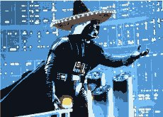
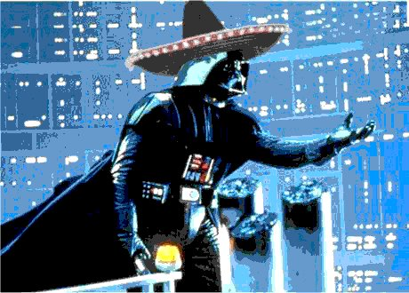
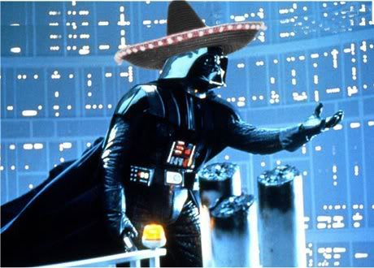

!SLIDE 

# History

!SLIDE 

# HTTP/0.9 Example

    @@@ http
    > GET http://mrwc2010.com/sombrero.xbm

!SLIDE

# HTTP/1.0 Example

    @@@ http
    > GET http://mrwc2010.com/sombrero.gif HTTP/1.0
    > User-Agent: Mozilla/4.03 [fr]

    < HTTP/1.0 200 OK
    < Date: Thu, 20 Jul 2000 06:43:02 GMT
    < Server: Apache/1.3.12 (Unix) PHP/3.0.9
    < Content-Type: image/gif

!SLIDE

# HTTP/1.1 Example

    @@@ http
    > GET /sombrero.jpg HTTP/1.1
    > Host: mwrc2010.com
    > User-Agent: Mozilla/5.0 (X11; U; Linux x86_64; en-US; rv:1.9.2) Gecko/20100207 Namoroka/3.6
    > Accept: image/png,image/*;q=0.8,*/*;q=0.5
    > Accept-Language: en-us,en;q=0.5
    > Accept-Encoding: gzip,deflate
    > Accept-Charset: ISO-8859-1,utf-8;q=0.7,*;q=0.7
    > Keep-Alive: 115
    > Connection: keep-alive

    < HTTP/1.1 200 OK
    < Last-Modified: Sun, 07 Mar 2010 21:44:54 GMT
    < Content-Type: image/jpeg
    < Content-Length: 51488
    < Connection: keep-alive
    < Server: thin 1.2.5 codename This Is Not A Web Server

!SLIDE center

!SLIDE 

# RFC 2616

    % wc rfc2616.txt 
    9859  57897 432144 rfc2616.txt

